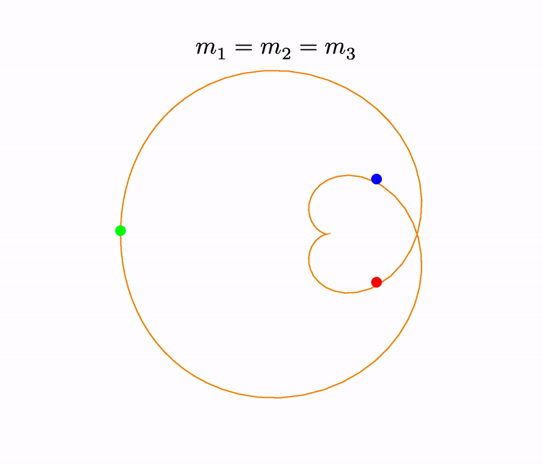

## Instructions

Check the template [`.tex`](template/template.tex) and [`.pdf`](template/template.pdf) files to get understanding of what is about to happen: we're going to change the data values of the points.

1. Check out this repository:

  * [Codeberg](https://codeberg.org/paveloom-o/A-LaTeX-PGF-TikZ-Animation)
  * [GitHub](https://github.com/paveloom-o/A-LaTeX-PGF-TikZ-Animation)
  * [GitLab](https://gitlab.com/paveloom-g/other/a-latex-pgf-tikz-animation)

2. Typeset the PDF frames:

    > ***NOTE:***  You will need [`tectonic`](https://tectonic-typesetting.github.io) installed.

    ```bash
    ./frames.bash --tectonic
    ```

    *or*

    > ***NOTE:***  You will need [`TexLive`](https://www.tug.org/texlive) installed.

    ```bash
    ./frames.bash --xelatex
    ```

    *or*

    > ***NOTE:***  You will need [`TexLive`](https://www.tug.org/texlive) installed.

    ```bash
    ./frames.bash --pdflatex
    ```

    > ***HINT:*** The speed of typesetting can vary notably between these engines.

3. Convert the PDFs to PNGs:

    > ***NOTE:***  You will need [`ImageMagick`](https://imagemagick.org) installed.

    ```bash
    ./convert.bash 540
    ```

    > ***HINT:*** The first argument is density.

4. Create the video and the GIF:

    > ***NOTE:***  You will need [`FFmpeg`](https://ffmpeg.org) installed.

    ```bash
    ./video.bash
    ```

The results are [`example.mp4`](example.mp4) and [`example.gif`](example.gif):


